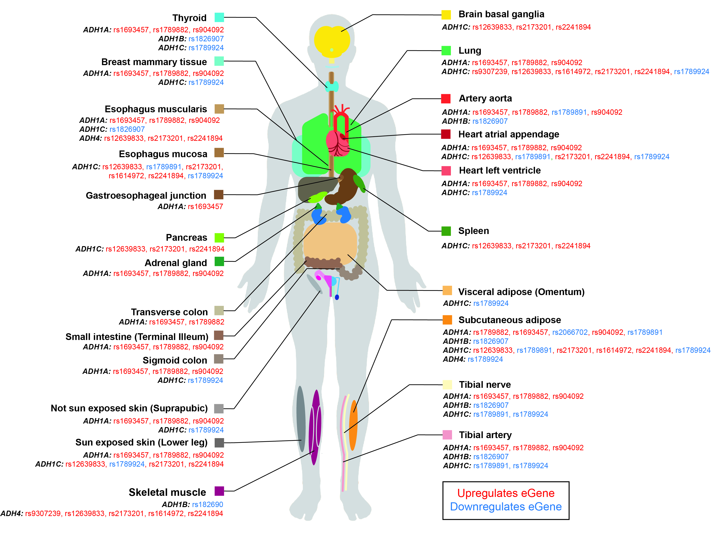

# Genetic variants associated with alcohol dependence co-ordinate regulation of *ADH* genes in gastrointestinal and adipose tissues

This repository contains scripts, data, results, figures and reproducibility report for "Genetic variants associated with alcohol dependence co-ordinate regulation of *ADH* genes in gastrointestinal and adipose tissues" study published in [Scientific Reports](https://www.nature.com/articles/s41598-020-66048-z). In this study, we integrate data from multiple sources (i.e. GWAS catalog, Hi-C, GTEx, HaploReg data) to analyze 73 AD associated SNPs and identify 34 expression quantitative loci (eQTL) with potential regulatory roles that impact alcohol dependence. We report that 42% of the 285 significant tissue-specific regulatory interactions we identify were associated with four genes encoding Alcohol Dehydrogenase - *ADH1A*, *ADH1B*, *ADH1C* and *ADH4*. Identified eQTLs produced a coordinated regulatory action between *ADH* genes, especially between *ADH1A* and *ADH1C* within the subcutaneous adipose and gastrointestinal tissues.  

Python (version 2.7.15), R (version 3.5.2) and RStudio (version 1.1.463) were used for data processing, analysis and visualisation.  

1. Cell type- and tissue-specific Hi-C data is available on [GEO](https://www.ncbi.nlm.nih.gov/geo/) database (accessions: GSE63525, GSE35156, GSE43070, GSE77565, GSE105194, GSE105513, GSE105544, GSE52457, GSE105914, GSE105957, GSE87112).  
2. RNA-seq and genotyping data (GTEx v7) are available via [dbGaP](https://www.ncbi.nlm.nih.gov/gap/) access (accession: phs000424.v7.p2).  
3. Human genome build hg19 release 75 (GRCh37) (“Homo_sapiens.GRCh37.75.dna.primary_assembly.fa.gz”) was downloaded from ftp://ftp.ensembl.org/pub/release-75/fasta/homo_sapiens/dna/.  
4. SNP genomic positions were obtained from ftp://ftp.ncbi.nih.gov/snp/organisms/human_9606_b151_GRCh37p13/.  
5. Gene annotation for GENCODE v19 (“gencode.v19.transcripts.patched_contigs.gtf”) was downloaded from https://storage.googleapis.com/gtex_analysis_v7/reference/.  
6. SNPs associated with alcohol dependence were downloaded from the [GWAS Catalog](www.ebi.ac.uk/gwas/) on 07/12/2018.  
7. Promoter-enhancer histone marks and affected regulatory motifs were obtained from the [HaploReg](https://pubs.broadinstitute.org/mammals/haploreg/haploreg.php) (version 4.1).  

&nbsp;

Tissue-specific effects of eQTLs for *ADH1A*, *ADH1B*, *ADH1C* and *ADH4* mapped to the human body.
Red text denotes the SNP upregulates the eGene, whereas blue text denotes downregulation.
